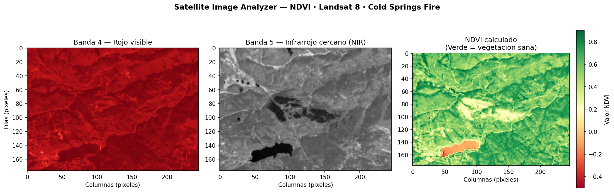

# 🛰️ Satellite NDVI Analyzer

Pipeline en Python para procesamiento de imágenes satelitales reales y cálculo del índice de vegetación NDVI usando datos Landsat 8.

---

## 📌 ¿Qué hace este proyecto?

Descarga y procesa imágenes satelitales multiespectrales del satélite **Landsat 8** para calcular el **NDVI (Normalized Difference Vegetation Index)** — un índice que permite identificar zonas con vegetación sana, suelo desnudo o áreas afectadas por incendios.

El dataset utilizado corresponde al incendio **Cold Springs Fire** (Colorado, EE.UU.), lo que permite visualizar claramente el contraste entre zonas quemadas y vegetación circundante.

---

## 📊 Resultado



El mapa de la derecha muestra el NDVI calculado:
- 🟢 **Verde** → vegetación sana (valores cercanos a +1)
- ⬜ **Blanco/amarillo** → suelo desnudo o escasa vegetación
- 🔴 **Rojo** → zona quemada (valores negativos)

---

## 🔬 ¿Cómo funciona?

El NDVI se calcula a partir de dos bandas espectrales del satélite:

```
NDVI = (NIR - RED) / (NIR + RED)
```

- **Banda 4 (RED)**: luz roja visible, absorbida por la clorofila
- **Banda 5 (NIR)**: infrarrojo cercano, reflejado por vegetación sana

---

## 🛠️ Stack

| Librería | Uso |
|---|---|
| `rasterio` | Lectura de archivos GeoTIFF (imágenes satelitales) |
| `NumPy` | Operaciones matemáticas sobre arrays de píxeles |
| `matplotlib` | Visualización del mapa NDVI |
| `pathlib` | Manejo de rutas de archivos |
| `urllib` | Descarga automática del dataset |

---

## 🚀 Cómo ejecutarlo

### 1. Clonar el repositorio
```bash
git clone https://github.com/nicolas-saleno/satellite-ndvi-analyzer.git
cd satellite-ndvi-analyzer
```

### 2. Instalar dependencias
```bash
pip install -r requirements.txt
```

### 3. Ejecutar
```bash
python ndvi_calculator.py
```

La primera ejecución descarga el dataset automáticamente (~40 MB). Las siguientes detectan que ya existe y no vuelven a descargarlo.

---

## 📁 Estructura del proyecto

```
satellite-ndvi-analyzer/
│
├── ndvi_calculator.py      # Script principal
├── ndvi_resultado.png      # Visualización generada
├── requirements.txt        # Dependencias
├── LEARNING.md             # Proceso de aprendizaje paso a paso
└── README.md
```

---

## 🗺️ Roadmap

- [x] Descarga automática del dataset
- [x] Cálculo de NDVI con bandas Landsat 8
- [x] Visualización de los tres paneles (B4, B5, NDVI)
- [ ] Exportar resultado como GeoTIFF georreferenciado
- [ ] Análisis de serie temporal (comparar fechas)
- [ ] Clasificación de cobertura del suelo con Machine Learning
- [ ] Interfaz via FastAPI para procesar imágenes on demand

---

## 👤 Autor

**Nicolás Saleño**  
[LinkedIn](https://linkedin.com/in/nicolás-agustín-saleño-565b19125) · [GitHub](https://github.com/nicolas-saleno)

---

*Proyecto de portfolio — parte de mi formación en Data Science y Machine Learning.*

